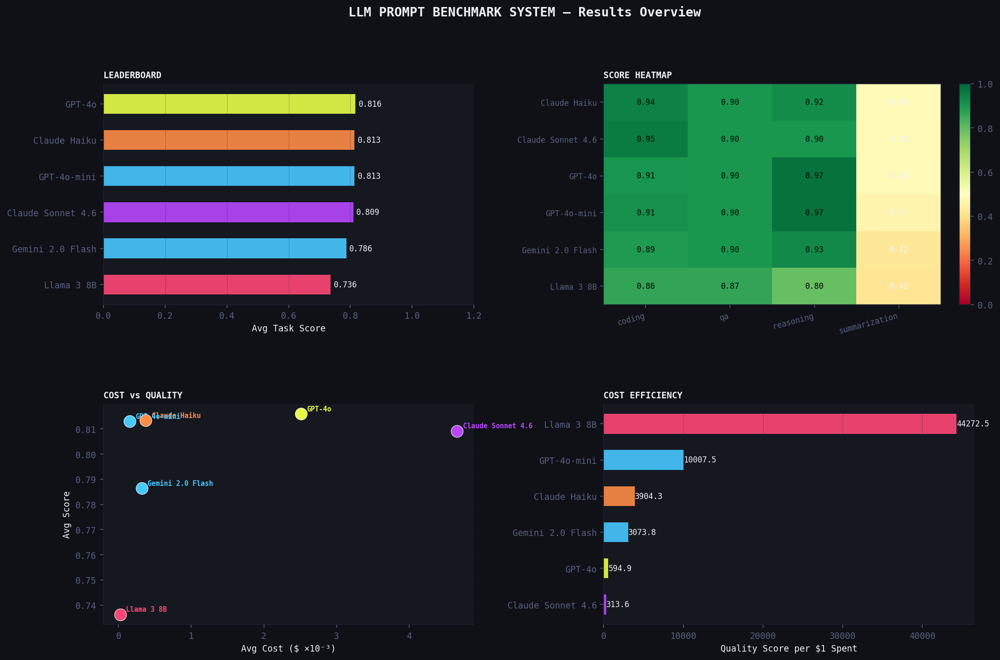

# 📊 P7 — LLM Prompt Benchmark System

> **Research-grade multi-task, multi-model evaluation with cost-per-quality analysis and interactive Streamlit dashboard**  
> Part of the [prompt-engineering-lab](../../README.md) portfolio

---

## Overview

Goes beyond single-task benchmarking — evaluates 6 models across 4 task types and 3 prompt strategies simultaneously, with a cost efficiency metric that answers the most practical question in production AI: *which model gives me the best quality for the money?*

| | |
|---|---|
| **Tasks** | Summarization · QA · Reasoning · Coding |
| **Models** | GPT-4o-mini · GPT-4o · Claude Haiku · Claude Sonnet 4.6 · Gemini 2.0 Flash · Llama 3 8B |
| **Strategies** | zero_shot · instructed · chain-of-thought / role-based / test-driven |
| **Test Cases** | 20 cases (5 per task) × 3 strategies = 60 prompt variants |
| **Metrics** | Task score · Cost (USD) · Quality per dollar · Latency |
| **Dashboard** | Streamlit — leaderboard, cost scatter, heatmaps, raw explorer |

---

## Dashboard

```bash
pip install streamlit
streamlit run dashboard.py
# Opens at http://localhost:8501
```



---

## Results

### Overall Leaderboard

| Rank | Model | Avg Score | Quality/$ | Avg Cost/Run | Avg Latency |
|------|-------|-----------|-----------|--------------|-------------|
| 1 | GPT-4o | 0.816 | 0.0 | $2.5000×10⁻³ | 3.41s |
| 2 | Claude Haiku | 0.813 | 0.0 | $0.4000×10⁻³ | 3.46s |
| 3 | GPT-4o-mini | 0.813 | 0.0 | $0.2000×10⁻³ | 6.12s |
| 4 | Claude Sonnet 4.6 | 0.809 | 0.0 | $4.7000×10⁻³ | 5.34s |
| 5 | Gemini 2.0 Flash | 0.786 | 0.0 | $0.3000×10⁻³ | 2.47s |
| 6 | Llama 3 8B | 0.736 | 0.0 | $0.0000×10⁻³ | 3.73s |

*Run `python update_findings.py` after the experiment to populate.*

### Per-Task Breakdown

| Task | Claude Haiku | Claude Sonnet 4.6 | GPT-4o | GPT-4o-mini | Gemini 2.0 Flash | Llama 3 8B |
|------|------|------|------|------|------|------|
| coding | 0.943 | 0.954 | 0.905 | 0.912 | 0.894 | 0.864 |
| qa | 0.900 | 0.900 | 0.900 | 0.900 | 0.900 | 0.867 |
| reasoning | 0.920 | 0.902 | 0.973 | 0.973 | 0.929 | 0.796 |
| summarization | 0.490 | 0.481 | 0.485 | 0.467 | 0.423 | 0.419 |

---

## Project Structure

```
prompt-benchmark-system/
├── dashboard.py          ← Streamlit dashboard (streamlit run dashboard.py)
├── run_benchmark.py      ← Benchmark runner CLI
├── evaluation.py         ← Task-specific scorers
├── costs.py              ← Token pricing + cost-per-quality calculator
├── visualize.py          ← Static chart generator
├── update_findings.py    ← Auto-populate README + findings
├── experiment.ipynb      ← Analysis notebook
├── tasks/
│   ├── __init__.py
│   └── task_definitions.py  ← 4 tasks × 5 cases × 3 prompts
└── results/
    ├── results.csv
    ├── leaderboard.csv
    ├── cost_leaderboard.csv
    ├── leaderboard_per_task.csv
    └── charts.png
```

---

## Quick Start

```bash
pip install -r requirements.txt

export OPENAI_API_KEY="sk-..."
export ANTHROPIC_API_KEY="sk-ant-..."
export OPENROUTER_API_KEY="sk-or-..."

# Quick test (2 cases/task, 1 strategy)
python run_benchmark.py --quick --models openai

# Full benchmark
python run_benchmark.py

# Static charts
python visualize.py

# Interactive dashboard
streamlit run dashboard.py

# Auto-fill README
python update_findings.py
```

---

## CLI Options

```
python run_benchmark.py [options]

  --models      openai,anthropic,openrouter
  --tasks       summarization,qa,reasoning,coding
  --strategies  zero_shot,instructed,cot
  --quick       2 cases/task, 1 strategy only
```

---

## Task Metrics

| Task | Metric | Description |
|------|--------|-------------|
| Summarization | `rouge_composite` | Average of ROUGE-1 and ROUGE-L F1 |
| QA | `factual_accuracy` | Keyword-based answer correctness (0, 0.5, 1.0) |
| Reasoning | `reasoning_score` | Answer correctness (0.6) + step validity (0.4) |
| Coding | `code_quality` | Keyword presence (0.5) + structure signals (0.5) |

---

## Cost Model

```python
from costs import calculate_cost, quality_per_dollar

cost = calculate_cost("GPT-4o-mini", prompt_tokens=500, completion_tokens=200)
# CostResult(total_cost_usd=0.000195)

qpd = quality_per_dollar(cost.total_cost_usd, task_score=0.72)
# 3692.3 quality points per dollar
```

Pricing is loaded from `costs.py` and can be updated as providers change rates.

---

## Related Projects

- **P4:** [Prompt Testing Framework](../prompt-testing-framework/) — `promptlab` A/B and batch runner underpin this
- **P6:** [Email Summarizer](../email-summarizer/) — summarization task reuses ROUGE metrics from here
- **P8:** [Hallucination Detection](../hallucination-detection/) — QA task connects to anti-hallucination pipeline

---

*prompt-engineering-lab / projects / prompt-benchmark-system*
