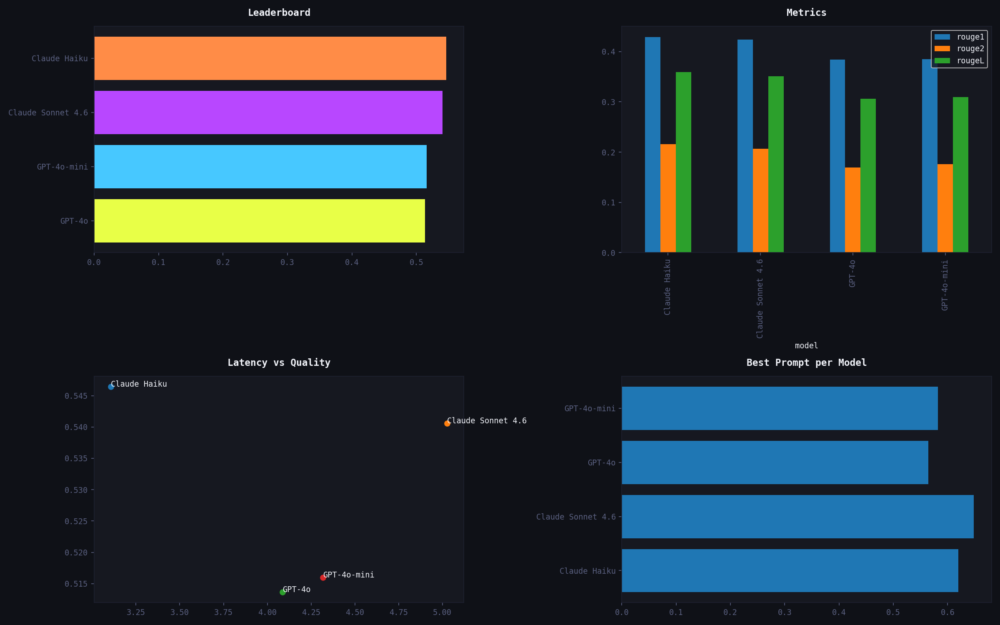

# 📊 P1 — Summarization Benchmark

> **Multi-model, multi-prompt summarization quality benchmark**  
> Part of the [prompt-engineering-lab](../../README.md) portfolio

-----

## Overview

Systematic evaluation of summarization quality across **4 LLMs** and **10 prompt strategies**, measuring what prompt engineering actually buys you — in numbers.

|            |                                                                                      |
|------------|--------------------------------------------------------------------------------------|
|**Models**  |GPT-4o-mini, GPT-4o, Claude Haiku, Claude Sonnet 4.6                                  |
|**Prompts** |10 strategies: zero-shot baseline → chain-of-thought, role-prompting, contrastive     |
|**Articles**|5 domains: Technology, Climate, Economics, Health, Geopolitics                        |
|**Metrics** |ROUGE-1/2/L · BERTScore F1 · Flesch-Kincaid · Compression Ratio · LLM-as-Judge        |

-----

## Results




### 🏆 Leaderboard (Top 5)

|Rank|Model             |Prompt|Strategy           |Composite Score|
|----|------------------|------|-------------------|---------------|
|1   |Claude Sonnet 4.6 |P02   |zero_shot          |0.64850        |
|2   |Claude Haiku      |P02   |zero_shot          |0.62000        |
|3   |GPT-4o-mini       |P09   |constrained_length |0.58250        |
|4   |Claude Haiku      |P09   |constrained_length |0.57590        |
|5   |GPT-4o            |P02   |zero_shot          |0.56470        |

*Run the experiment to populate this table. See `results/leaderboard.csv` for full results.*

### Key Findings

- **Best combination:** Claude Sonnet 4.6 × P02 (zero_shot) — score: 0.648
- **Best performing model overall:** Claude Haiku (avg: 0.546)
- **Weakest model:** GPT-4o (avg: 0.514)
- **Prompt engineering impact:** +24.9% vs zero-shot baseline
- **Baseline zero-shot average:** 0.519
- **Best score achieved:**        0.648

-----

## Project Structure

```
summarization-benchmark/
├── experiment.ipynb        ← Main analysis notebook (start here)
├── run_experiment.py       ← CLI runner — calls all APIs, saves results
├── evaluation.py           ← Metrics engine (ROUGE, BERTScore, FK, LLM judge)
├── visualize.py            ← Chart generator (7 charts)
├── prompts/
│   └── prompts.txt         ← 10 annotated prompt strategies
├── data/
│   └── articles.csv        ← 5 benchmark articles with reference summaries
└── results/
    ├── results.csv         ← Raw results (every model × prompt × article)
    ├── leaderboard.csv     ← Aggregated rankings
    ├── charts.png          ← 4-panel overview (README hero)
    ├── chart_leaderboard.png
    ├── chart_heatmap.png
    ├── chart_prompt_strategies.png
    ├── chart_latency_quality.png
    ├── chart_radar.png
    └── chart_domain.png
```

-----

## Quick Start

### 1. Install dependencies

```bash
pip install openai anthropic google-generativeai pandas numpy matplotlib bert-score
```

### 2. Set API keys

```bash
export OPENAI_API_KEY="sk-..."
export ANTHROPIC_API_KEY="sk-ant-..."
export GOOGLE_API_KEY="AIza..."
```

### 3. Run a quick test (2 articles, 3 prompts, 1 provider)

```bash
python run_experiment.py --quick --models openai
```

### 4. Run the full benchmark

```bash
python run_experiment.py
```

### 5. Generate charts

```bash
python visualize.py
```

### 6. Explore in notebook

```bash
jupyter notebook experiment.ipynb
```

-----

## CLI Options

```
python run_experiment.py [options]

  --models    openai,anthropic,google   Filter to specific providers
  --prompts   P01,P05,P07               Filter to specific prompt IDs
  --articles  A01,A02                   Filter to specific articles
  --llm-judge                           Enable LLM-as-judge scoring
  --quick                               Fast subset: 2 articles, 3 prompts
```

-----

## Metrics Reference

|Metric           |What It Measures                           |Range|Higher = Better  |
|-----------------|-------------------------------------------|-----|-----------------|
|ROUGE-1          |Unigram overlap with reference             |0–1  |✓                |
|ROUGE-2          |Bigram overlap with reference              |0–1  |✓                |
|ROUGE-L          |Longest common subsequence                 |0–1  |✓                |
|BERTScore F1     |Semantic similarity (contextual embeddings)|0–1  |✓                |
|Composite        |0.2×R1 + 0.2×R2 + 0.2×RL + 0.4×BERT        |0–1  |✓                |
|Flesch-Kincaid   |US grade level readability                 |1–20 |Context-dependent|
|Compression Ratio|Summary length / original length           |0–1  |Context-dependent|
|LLM Judge        |Faithfulness, Coverage, Fluency, Coherence |1–5  |✓                |

-----

## Prompt Strategies Tested

|ID |Strategy                 |Description                            |
|---|-------------------------|---------------------------------------|
|P01|`zero_shot`              |Baseline — no engineering              |
|P02|`zero_shot`              |TL;DR prompt                           |
|P03|`instructed`             |Explicit length + focus constraints    |
|P04|`structured_output`      |3-bullet forced format                 |
|P05|`role_prompting`         |Expert editor persona + audience target|
|P06|`structured_extraction`  |Labeled field extraction               |
|P07|`chain_of_thought`       |Step-by-step reasoning before summary  |
|P08|`contrastive_instruction`|Explicit DO/DON’T rules                |
|P09|`constrained_length`     |Target 10% compression                 |
|P10|`audience_adaptation`    |Three parallel audience variants       |

-----

## Reproducing Results

All experiments are fully reproducible:

- Fixed `temperature=0.3` across all models
- Identical article texts for all model calls
- Results saved with model version, prompt ID, and timestamp

-----

## Related Projects

- **P3:** [Instruction Following Benchmark](../instruction-following/) — uses this project’s eval infrastructure
- **P6:** [Prompt Testing Framework](../prompt-testing-framework/) — built from patterns discovered here
- **P7:** [LLM Prompt Benchmark System](../prompt-benchmark-system/) — extends this into a full dashboard

-----

*prompt-engineering-lab / projects / summarization-benchmark*
